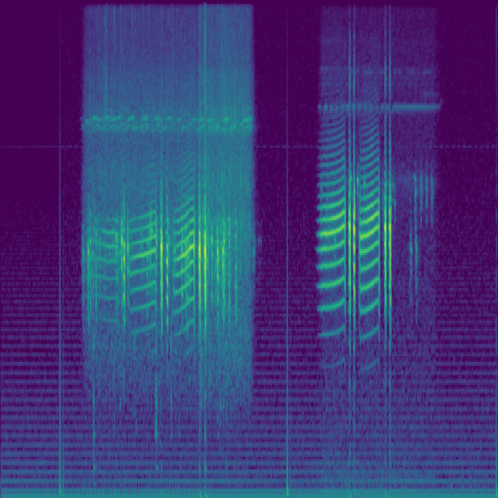

# 🐸 Frog Classifier — Western Cape



## Project Overview

This project aims to develop a robust machine learning classifier capable of identifying the **three most common frog species in the Western Cape, South Africa**, based solely on their vocalizations. Leveraging the power of **mel spectrograms** and convolutional neural networks (CNNs), the model is trained on real frog call recordings to support bioacoustic monitoring efforts in the region.

The classifier will eventually be deployed on a mobile platform for real-time, in-field use by researchers, conservationists, and citizen scientists.

---

## 🧪 Pipeline Summary

1. **Preprocessing**
   - Converts `.wav` audio recordings into mel spectrograms.
   - Spectrograms are saved to an HDF5 dataset for efficient access.
   - Key parameters:
     - Sampling Rate: `22050 Hz`
     - FFT Window Size: `2048`
     - Hop Length: `256`
     - Mel Bands: `256`

   Code Reference: [`audio-to-spectro.1.3.py`](./audio-to-spectro.1.3.py)

2. **Modeling (WIP)**
   - CNN-based architecture optimized for noisy, low-data bioacoustic environments.
   - Regularization techniques like dropout (e.g., 0.5) considered for generalization.

3. **Deployment (Planned)**
   - Local inference via mobile app.
   - Offline spectrogram generation and prediction.
   - Potential integration with conservation and species ID tools.

---

## 🐸 Target Frog Species

- *Breviceps adspersus* (Mountain Rain Frog)
- *Strongylopus grayii* (Clicking Stream Frog)
- *Cacosternum nanum* (Southern Dainty Frog)

*Spectrogram above: Example from the Natal Tree Frog dataset.*

---

## 📂 Directory Structure

```
.
├── audio-to-spectro.1.3.py       # Preprocessing script
├── preprocessing/
│   └── frog_sounds_wav/         # Raw .wav files of frog calls
├── Datasets/
│   └── FD-0.3/
│       └── spectrograms.h5      # Output dataset of spectrograms
└── model/                       # (Planned) Model training code and weights
```

---

## 🔧 Requirements

- Python 3.8+
- `librosa`
- `numpy`
- `h5py`
- `joblib`
- `tqdm`

Install via:

```bash
pip install -r requirements.txt
```

---

## 🚀 Run Preprocessing

```bash
python audio-to-spectro.1.3.py
```

Generates mel spectrograms from all `.wav` files in `./preprocessing/frog_sounds_wav/` and saves them into `./Datasets/FD-0.3/spectrograms.h5`.

---

## 🧠 Goals

- Build a lightweight, field-ready frog call classification system.
- Address training challenges on small, noisy datasets using tailored CNNs.
- Support regional conservation efforts with automated species detection.

---

## 📜 License

MIT License. See `LICENSE` for details.

---

## 👨‍🔬 Author

**James Devine**  
Final-year Electrical & Electronic Engineering Student  
Stellenbosch University, 2025
